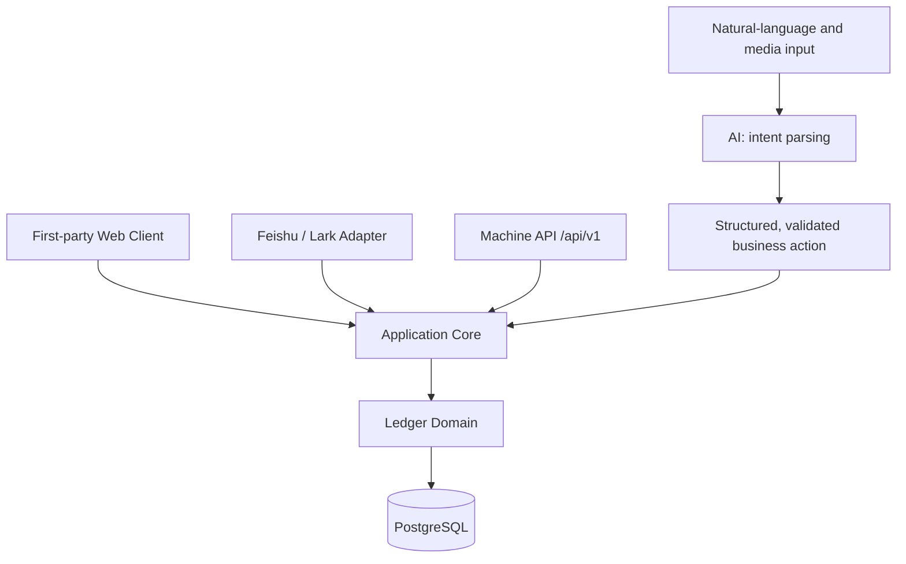

# LarkLedger

> **Self-hosted AI-first personal & family finance.**
>
> Track, organize, and understand a real ledger through the Web, Feishu/Lark, or an open API. The Web is a first-party client; Feishu/Lark is a natural-language adapter; all clients share one ledger core.

**Web · Feishu/Lark · API**

[Open the Web client](https://ledger.overme.cn/) · [Quick start](#quick-start) · [User guide](docs/help.md) · [Client API](docs/client-api.md) · [Architecture](docs/architecture.md)

[简体中文](README.md) | English

[](https://github.com/0verme/LarkLedger/actions/workflows/ci.yml)
[](LICENSE)
[](https://www.python.org/)


## Why LarkLedger

Personal and household finances should not be trapped in one chat window or maintained only in a spreadsheet. LarkLedger brings natural-language bookkeeping, transactions, accounts, budgets, goals, and insights into one ledger system: you self-host the data, choose the client that fits the moment, and keep financial facts in deterministic business logic.

**AI understands input; deterministic business logic owns ledger facts.** Text, images, receipts, voice, and batches are parsed into structured intents. Validation, risk confirmation, authorization, and final writes stay in the application and ledger domain. The AI never accesses the database and never generates or executes SQL.

## Product preview

| Transactions | Quick entry |
| --- | --- |
|  |  |
| Budgets | Reports |
|  |  |

## Core capabilities

### AI bookkeeping

Handle text, images, receipts, voice, and batch input. Clear single-entry text can be posted directly; images, voice, batches, and likely duplicates can enter Pending first and require confirmation before they become ledger facts.

### Web finance center

Use the first-party Web Client for overview, transactions and revisions, search/filtering, edits, soft delete and restore, accounts and transfers, budgets, reports, and CSV export.

### Personal and household ledgers

Maintain multiple isolated personal ledgers and shared household ledgers with payer attribution and account-level shared/private visibility. Joining a household does not expose a personal account by default.

### Automation and insights

Recurring Rules turn future periodic income and expenses into confirmation-ready items. Goals derive progress from the live balances of bound accounts. Insights use deterministic rules to explain spending changes, budget risk, upcoming recurring expenses, and goal progress—not to provide investment advice.

### Multiple clients, one core

The Web, Feishu/Lark, and `/api/v1` Machine API all enter the same Application Core. Authorization, budgets, privacy, revisions, and Pending behavior stay consistent across clients.

### Self-hosted and operable

Built with FastAPI, React / TypeScript / Vite, PostgreSQL, and Docker Compose. A transactional outbox, durable idempotency, worker retries/leases, health/readiness checks, and operational status endpoints support observable, recoverable self-hosted deployments.

## AI bookkeeping

Inputs follow a controlled business path:

```text
Text / image / receipt / voice / batch input
                  ↓
           Intent parsing
                  ↓
        Schema and business validation
                  ↓
       High-risk action → Pending confirmation
                  ↓
       Application Core → Ledger
                  ↓
              PostgreSQL
```

A confirmation stores the frozen structured result; confirming it does not call the AI again. Natural language lowers the cost of bookkeeping without allowing a model to decide ledger facts directly.

## Feishu / Lark: a natural-language adapter

Feishu is one way to use LarkLedger, not the product boundary. Send text, voice, receipts, or payment screenshots in Feishu; the same ledger, authorization, and risk-confirmation rules apply to Web and API clients.

| Batch bookkeeping from images | Batch bookkeeping from voice |
| --- | --- |
|  |  |
| Receipt bookkeeping | Complex text batch bookkeeping |
|  |  |

## Multi-client architecture



AI participates in input understanding and intent parsing; it does not bypass the Application Core to access the ledger database.

## Self-hosted

- **Backend**: FastAPI + SQLAlchemy + Alembic
- **Web**: React / TypeScript / Vite; production images can serve the built assets from FastAPI
- **Storage**: PostgreSQL; the development Compose overlay can provide local PostgreSQL 16
- **Deployment**: Docker Compose; WebSocket long connection or Webhook
- **Operations**: `/healthz`, `/readyz`, `/version`, `/ops/status`, plus outbox, workers, backup/restore, and guarded replay paths

See the [environment and deployment guide](docs/environment.md), [operations guide](docs/operations.md), [backup/restore SOP](docs/backup-restore.md), and [security policy](SECURITY.md) for the details.

## Quick start

The recommended first verification path is **WebSocket long connection + text-only + PostgreSQL + Docker Compose**. It does not require a public callback URL; the host still needs outbound access to Feishu and your text AI provider.

### 1. Clone and configure

```bash
git clone https://github.com/0verme/LarkLedger.git
cd LarkLedger
cp .env.example .env
# Windows PowerShell: Copy-Item .env.example .env
```

Set the minimum values in `.env`:

```dotenv
LARK_LEDGER_EVENT_MODE=websocket
LARK_LEDGER_DATABASE_URL=postgresql+asyncpg://lark_ledger:change-me@db:5432/lark_ledger
LARK_LEDGER_LARK_APP_ID=cli_xxxxxxxxxxxxx
LARK_LEDGER_LARK_APP_SECRET=replace-me
LARK_LEDGER_AI_API_KEY=replace-me
LARK_LEDGER_AI_BASE_URL=https://api.deepseek.com
LARK_LEDGER_AI_MODEL=deepseek-v4-flash
```

### 2. Start the app and PostgreSQL

```bash
docker compose -f compose.yaml -f compose.dev.yaml up -d --build
docker compose -f compose.yaml -f compose.dev.yaml ps
curl http://127.0.0.1:8000/healthz
curl -f http://127.0.0.1:8000/readyz
```

In the Feishu developer console, enable the bot, select long connection, subscribe to `im.message.receive_v1`, start the app, and send one text entry. The [environment guide](docs/environment.md) covers permissions, Webhook, production PostgreSQL, and the Web Client.

### 3. Enable the first-party Web Client (optional)

The Web Client requires Dashboard settings, a Human Session secret, and an OAuth callback registered in the Feishu app. Node.js is not required at runtime; production must use HTTPS. Follow [the Web Dashboard deployment guide](docs/environment.md#web-dashboard可选), and never commit a session secret or API token.

## Client API

`/api/v1` is the channel-neutral Machine API for CLI tools, hardware, automation, and future clients. It uses revocable, expiring bearer tokens; ledger writes require an `Idempotency-Key`; and it enters the same Application Core as Web and Feishu.

```bash
curl -s https://ledger.example/api/v1/me \\
  -H "Authorization: Bearer $TOKEN"
```

See the [Client API documentation](docs/client-api.md) for resources, scopes, error envelopes, idempotency semantics, and OpenAPI details.

## Who it is for

- Self-hosters who want to keep personal financial data under their control
- Households that need personal and shared ledgers side by side
- Technical users who want natural-language bookkeeping plus Web and API workflows
- Operators comfortable configuring Docker, PostgreSQL, and a Feishu app

## Known limitations

LarkLedger is for personal and household finance, not an enterprise ERP, double-entry accounting system, or Splitwise:

- No bank sync, complex RBAC, multi-level approval, organization-scale multi-tenancy, or enterprise accounting reports
- No investment, stock, loan, or tax advice, and no automatic money movement
- Outbox, idempotency, and high-risk confirmation reduce failure and accidental-action risk, but the project does not claim “never duplicate a reply” or “never double-bookkeep”
- The [architecture](docs/architecture.md), [security policy](SECURITY.md), and [operations documentation](docs/operations.md) define the reliability, privacy, backup, and deployment boundaries

## Documentation

- [User guide](docs/help.md): bookkeeping, households, budgets, reports, Pending, and limitations
- [Environment and deployment](docs/environment.md): configuration, PostgreSQL, Feishu permissions, Webhook, and Web Client
- [Client API](docs/client-api.md): `/api/v1`, bearer tokens, idempotency, and error contracts
- [Architecture](docs/architecture.md): Application Core, adapters, AI boundary, and ledger model
- [Security policy](SECURITY.md): security boundary and vulnerability reports
- [Operations](docs/operations.md): health/readiness, workers, backlog, and troubleshooting
- [Backup / restore SOP](docs/backup-restore.md)
- [Upgrade guide](docs/upgrading.md)
- [FNOS deployment](docs/deployment-fnos.md)
- [Changelog](CHANGELOG.md) and [GitHub Releases](https://github.com/0verme/LarkLedger/releases): release history and current image information
- [Contributing](CONTRIBUTING.en.md) · [中文 README](README.md)

The README is the product entry point; phase numbers, release-by-release notes, and release operations live in the linked documentation instead.

## Development

```bash
python -m venv .venv
source .venv/bin/activate  # Windows: .venv\Scripts\Activate.ps1
pip install -e ".[dev]"
alembic upgrade head
uvicorn lark_ledger.main:app --reload
```

Read the [contributing guide](CONTRIBUTING.en.md) before opening a pull request. Most deep operational documentation is Chinese-first; the linked files are authoritative.

## License

[Apache License 2.0](LICENSE)
