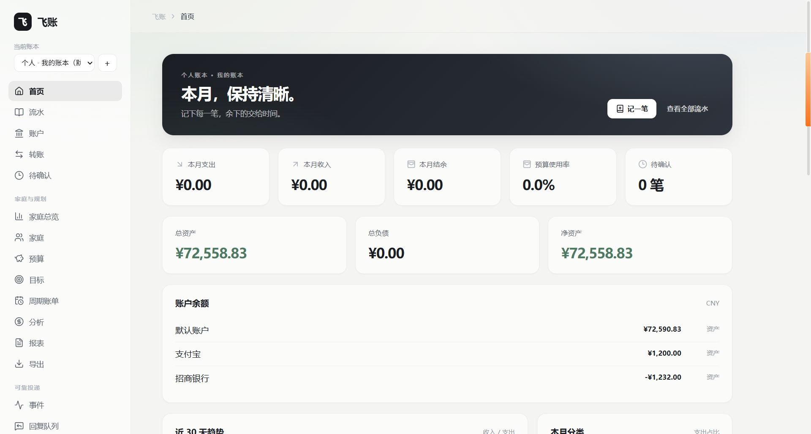
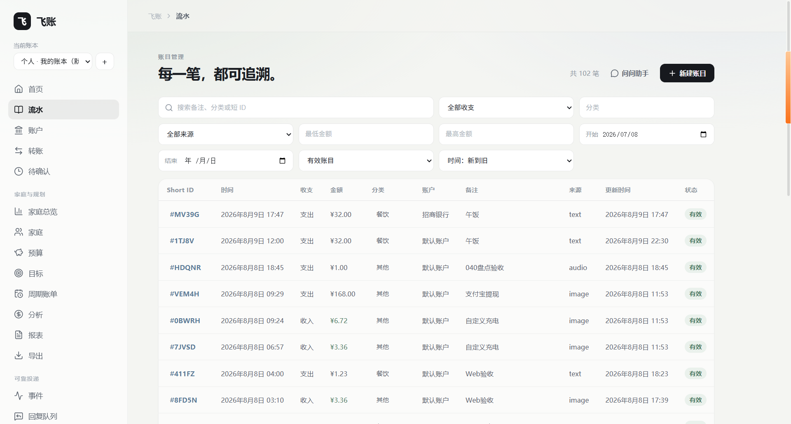
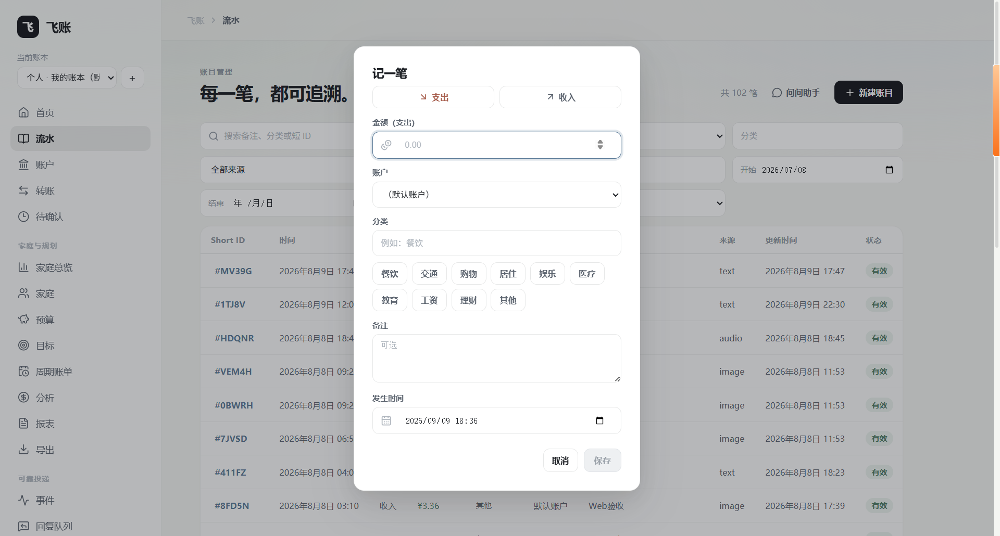
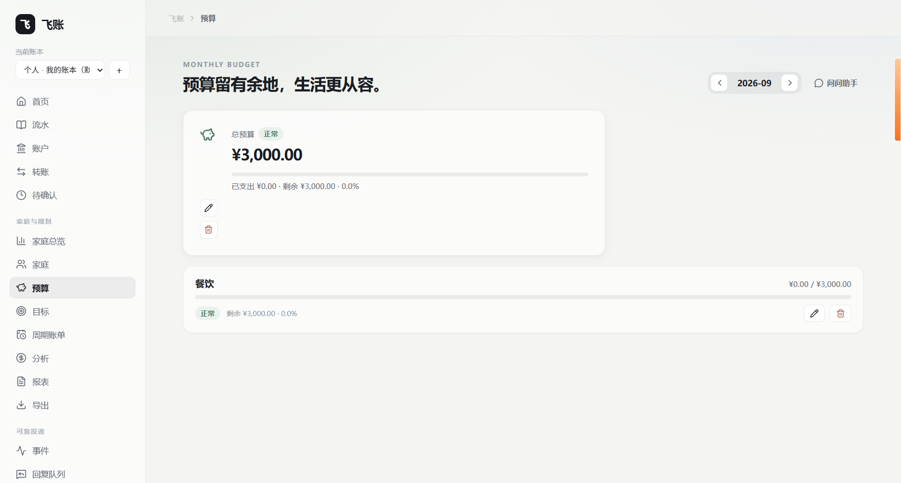
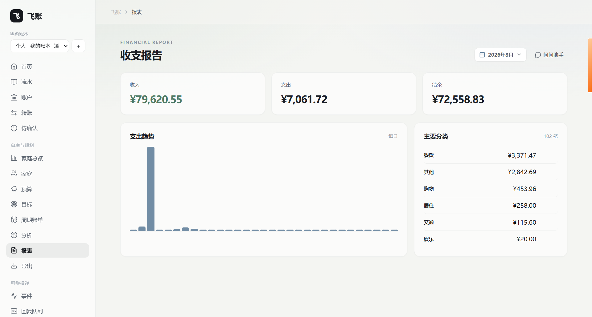
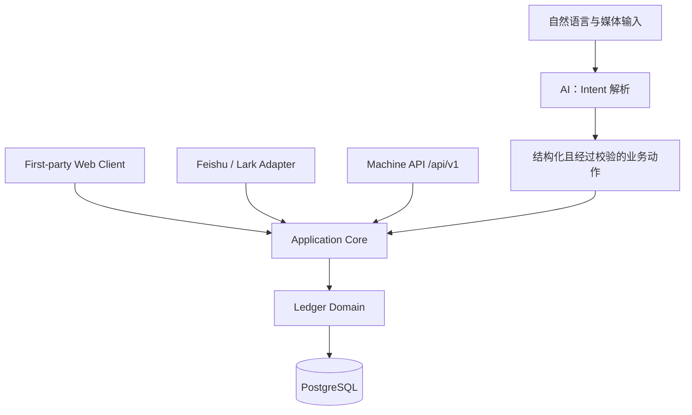

# LarkLedger（飞账）

> **自托管的 AI-first 个人与家庭财务系统。**
>
> 用 Web、Feishu/Lark 或开放 API 记录、整理和理解你的真实账本。Web 是一等客户端，飞书/Lark 是自然语言适配器，三者共享同一个账本核心。

**Web · Feishu/Lark · API**

[打开 Web](https://ledger.overme.cn/) · [快速开始](#快速开始) · [用户手册](docs/help.md) · [Client API](docs/client-api.md) · [架构说明](docs/architecture.md)

[English](README.en.md) | 简体中文

[](https://github.com/0verme/LarkLedger/actions/workflows/ci.yml)
[](LICENSE)
[](https://www.python.org/)



## 为什么是飞账

个人和家庭财务不应该被锁在某个聊天窗口里，也不应该只能靠表格维护。LarkLedger 将自然语言记账、流水、账户、预算、目标和洞察组织成一个真正的账本系统：数据由你自托管，入口可以按习惯选择，财务事实始终由确定性的业务逻辑处理。

**AI 负责理解输入，账本事实由确定性业务逻辑处理。** AI 会把文字、图片、小票、语音或批量内容解析为结构化 Intent；校验、风险确认、授权和最终写入由应用与账本领域逻辑完成。AI 不直接访问数据库，也不生成或执行 SQL。

## 产品展示

| 流水管理 | 快速记账 |
| --- | --- |
|  |  |
| 预算 | 收支报告 |
|  |  |

## 核心能力

### AI 记账

支持文字、图片、小票、语音和批量输入。简单明确的文字可以直接记账；图片、语音、批量或疑似重复等高风险结果会先进入 Pending，确认后才写入账本。

### Web 财务中心

通过 First-party Web Client 查看总览、流水和 revision，搜索/筛选、修改、软删除与恢复账目，管理账户与转账，并使用预算、报告和 CSV 导出。

### 个人与家庭账本

支持多个相互隔离的个人账本，也支持家庭共享账本、付款人归属和账户级共享/私人可见性。个人财务不会因为加入家庭而自动暴露。

### 财务自动化与洞察

Recurring Rules 将未来的周期性收支变成待确认事项；Goals 从绑定账户的真实余额派生进度；Insights 用确定性规则解释支出变化、预算风险、周期支出和目标进度，而不是提供投资建议。

### 多入口，共享核心

Web、Feishu/Lark 和 `/api/v1` Machine API 都进入同一个 Application Core。相同的账本事实使用一致的授权、预算、隐私、revision 和 Pending 规则。

### Self-hosted 与可靠运维

基于 FastAPI、React / TypeScript / Vite、PostgreSQL 和 Docker Compose。事务性 Outbox、持久化幂等、Worker 重试/租约、health/readiness 检查和运维状态接口，帮助长期运行的自托管实例保持可观察、可恢复。

## AI 记账

输入经过一条受控的业务路径：

```text
文字 / 图片 / 小票 / 语音 / 批量输入
                ↓
         Intent 解析与结构化
                ↓
          Schema / 业务校验
                ↓
       高风险操作 → Pending 确认
                ↓
       Application Core → Ledger
                ↓
             PostgreSQL
```

确认单保存冻结后的结构化结果，确认时不会重新调用 AI。这样自然语言可以降低记账成本，同时不会让模型直接决定账本事实。

## Feishu / Lark：自然语言适配器

飞书是 LarkLedger 的一个使用入口，而不是产品边界。你可以在飞书中发送文字、语音、小票或支付流水图片；识别结果遵循同样的账本、授权和风险确认规则，Web 与 API 也共享这些业务语义。

| 图片批量记账 | 语音批量记账 |
| --- | --- |
|  |  |
| 小票记账 | 复杂文字批量记账 |
|  |  |

## 多入口架构



AI 只参与输入理解与 Intent 解析；它不会绕过 Application Core 直接访问账本数据库。

## Self-hosted

- **Backend**：FastAPI + SQLAlchemy + Alembic
- **Web**：React / TypeScript / Vite，生产镜像可由 FastAPI 提供静态资源
- **Storage**：PostgreSQL；开发 Compose 叠加文件可提供本地 PostgreSQL 16
- **Deployment**：Docker Compose；支持 WebSocket 长连接或 Webhook
- **Operations**：`/healthz`、`/readyz`、`/version`、`/ops/status`，以及 Outbox、Worker、备份/恢复和受控重放路径

详细配置、权限和安全边界见[环境与部署指南](docs/environment.md)、[运维与可观测性](docs/operations.md)、[备份 / 恢复 SOP](docs/backup-restore.md)与[安全策略](SECURITY.md)。

## 快速开始

推荐的首次验证路径是 **WebSocket 长连接 + 文字-only + PostgreSQL + Docker Compose**。它不需要公网回调地址；运行主机仍需能主动访问 Feishu 开放平台和文字 AI 服务。

### 1. 获取代码并准备配置

```bash
git clone https://github.com/0verme/LarkLedger.git
cd LarkLedger
cp .env.example .env
# Windows PowerShell: Copy-Item .env.example .env
```

在 `.env` 中填写最小配置：

```dotenv
LARK_LEDGER_EVENT_MODE=websocket
LARK_LEDGER_DATABASE_URL=postgresql+asyncpg://lark_ledger:change-me@db:5432/lark_ledger
LARK_LEDGER_LARK_APP_ID=cli_xxxxxxxxxxxxx
LARK_LEDGER_LARK_APP_SECRET=replace-me
LARK_LEDGER_AI_API_KEY=replace-me
LARK_LEDGER_AI_BASE_URL=https://api.deepseek.com
LARK_LEDGER_AI_MODEL=deepseek-v4-flash
```

### 2. 启动应用与 PostgreSQL

```bash
docker compose -f compose.yaml -f compose.dev.yaml up -d --build
docker compose -f compose.yaml -f compose.dev.yaml ps
curl http://127.0.0.1:8000/healthz
curl -f http://127.0.0.1:8000/readyz
```

然后在飞书开放平台启用机器人、选择长连接、订阅 `im.message.receive_v1`，启动应用并发送一笔文字账。完整权限清单、Webhook 路径、生产 PostgreSQL 和 Web Client 配置见[环境与部署指南](docs/environment.md)。

### 3. 启用 First-party Web Client（可选）

Web Client 需要启用 Dashboard、配置 Human Session 密钥，并在 Feishu 应用中登记 OAuth callback。它不需要 Node.js 运行时；生产环境必须使用 HTTPS。请按[环境与部署指南 · Web Dashboard](docs/environment.md#web-dashboard可选)配置，不要把 session secret 或 API token 提交到仓库。

## Client API

`/api/v1` 是面向 CLI、硬件、自动化和未来客户端的通道无关 Machine API。它使用可撤销、可过期的 Bearer Token，账本写请求要求 `Idempotency-Key`，并与 Web、Feishu 进入同一个 Application Core。

```bash
curl -s https://ledger.example/api/v1/me \\
  -H "Authorization: Bearer $TOKEN"
```

完整资源、权限、错误 envelope、幂等语义和 OpenAPI 说明见[Client API 文档](docs/client-api.md)。

## 适合谁

- 想自己掌握财务数据的个人自托管用户
- 需要个人账本与家庭共享账本并存的家庭
- 希望用日常语言记账，同时保留 Web 和 API 工作流的技术用户
- 能配置 Docker、PostgreSQL 和 Feishu 应用的部署者

## 已知限制

LarkLedger 面向个人与家庭财务，不是企业 ERP、复式记账系统或 Splitwise：

- 不包含银行卡同步、复杂 RBAC、多级审批、组织级多租户或企业财务报表
- 不提供投资、股票、贷款、税务等金融建议，也不自动执行资金操作
- Outbox、幂等和高风险确认用于降低故障与误操作风险，但项目不宣称“绝不重复回复”或“绝不重复记账”
- 可靠性、隐私模型、备份恢复和部署边界以[架构说明](docs/architecture.md)、[安全策略](SECURITY.md)和[运维文档](docs/operations.md)为准

## 文档

- [用户手册](docs/help.md)：记账、家庭、预算、报告、Pending 和限制
- [环境与部署指南](docs/environment.md)：环境变量、PostgreSQL、Feishu 权限、Webhook、Web Client
- [Client API](docs/client-api.md)：`/api/v1`、Bearer Token、幂等和错误契约
- [架构说明](docs/architecture.md)：Application Core、Adapters、AI 边界和账本模型
- [安全策略](SECURITY.md)：漏洞报告与安全边界
- [运维与可观测性](docs/operations.md)：health/readiness、Worker、积压和故障定位
- [备份 / 恢复 SOP](docs/backup-restore.md)
- [升级指南](docs/upgrading.md)
- [飞牛 NAS 部署](docs/deployment-fnos.md)
- [变更日志](CHANGELOG.md)与 [GitHub Releases](https://github.com/0verme/LarkLedger/releases)：版本历史与当前镜像信息
- [贡献指南](CONTRIBUTING.md) · [English README](README.en.md)

README 负责产品入口；阶段编号、逐版本变更和发布操作不在这里重复维护。

## Development

```bash
python -m venv .venv
# Linux / macOS
source .venv/bin/activate
# Windows PowerShell
.venv\Scripts\Activate.ps1
pip install -e ".[dev]"
alembic upgrade head
uvicorn lark_ledger.main:app --reload
```

贡献前请阅读[贡献指南](CONTRIBUTING.md)。

## License

LarkLedger 使用 [Apache License 2.0](LICENSE) 开源。
