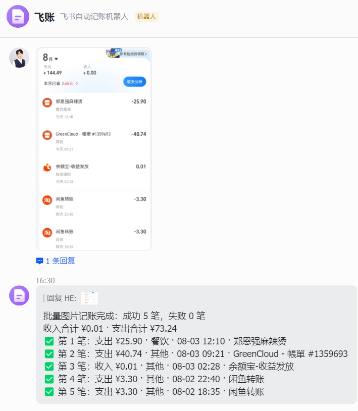
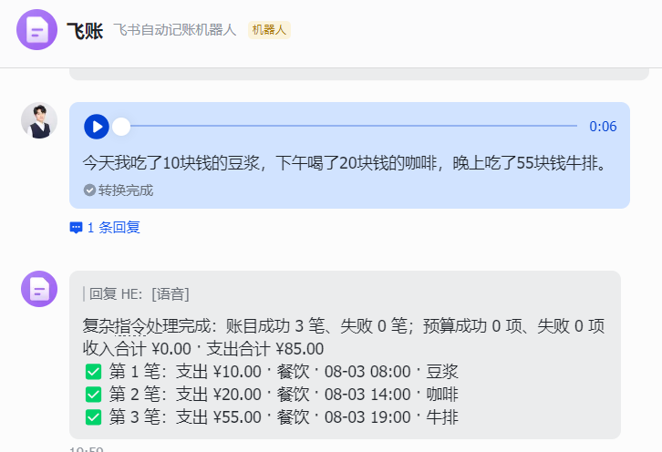
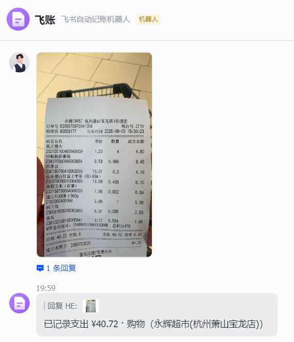
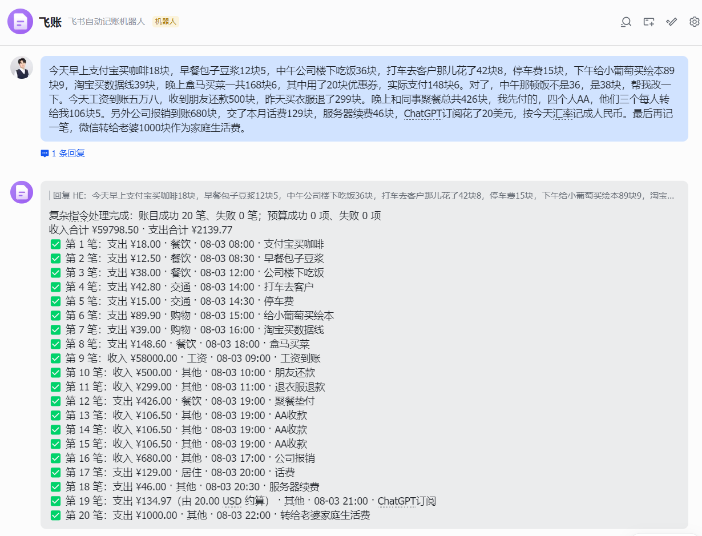

# LarkLedger（飞账）

[English](README.en.md) | 简体中文

> 自托管的飞书 / Lark AI 记账机器人。账本保存在你自己的 PostgreSQL 中；大模型只负责把消息变成经过严格校验的业务动作。

[](https://github.com/0verme/LarkLedger/actions/workflows/ci.yml)
[](LICENSE)
[](https://www.python.org/)

## 当前能力（v0.2.0）

- **文字记账**，成功回复含用户内唯一五位短 ID（`#XXXXX`）
- **最近账目 / 单笔详情**（例如 `最近10笔`、`查看 #XXXXX`）
- **按短 ID 修改、软删除与恢复**（另保留「上一笔」快捷方式）
- **CSV 导出**本人账目（飞书文件消息；需额外文件权限）
- 汇总、分类月预算、消费报告
- 图片 / 语音记账（扩展能力，快速路径不要求）
- 多用户隔离（`open_id`）、事件 `event_id` 幂等 claim
- 自托管：FastAPI、PostgreSQL、Docker Compose

完整消息示例见[用户手册](docs/help.md)。

## 适合谁

- 技术用户，能配置 Docker 与 PostgreSQL
- 重度飞书用户，希望**自托管**个人账本
- 首次部署只想尽快完成**一笔纯文字记账**

不适合：需要 Web 管理页、共享账本、强一致投递保证（业务写入与事件状态尚未原子一致，见下方限制与路线）。事件处理失败会自动重试并最终进入 dead。

## 快速开始（推荐）

主路径：**WebSocket 长连接 + 文字-only + PostgreSQL + Docker Compose**。

不需要公网回调 URL；服务器仍需能**主动访问**飞书开放平台与文字 AI API。

```text
已有 Docker
→ 创建飞书自建应用（机器人 + 长连接 + 消息事件）
→ 准备 PostgreSQL（推荐 compose.dev 一键体验）
→ 填写最小 .env
→ docker compose 启动
→ 检查 healthz 与日志
→ 飞书发送「午饭32元」
→ 收到含 #XXXXX 的记账回复
→ 发送「最近10笔」核对
```

### 1. 复制环境变量

```bash
cp .env.example .env
```

Windows PowerShell：`Copy-Item .env.example .env`

### 2. 填写最小必填项

文字-only 快速路径只需：

```dotenv
LARK_LEDGER_EVENT_MODE=websocket
LARK_LEDGER_DATABASE_URL=postgresql+asyncpg://lark_ledger:change-me@db:5432/lark_ledger
LARK_LEDGER_LARK_APP_ID=cli_xxxxxxxxxxxxx
LARK_LEDGER_LARK_APP_SECRET=replace-me
LARK_LEDGER_AI_API_KEY=replace-me
LARK_LEDGER_AI_BASE_URL=https://api.deepseek.com
LARK_LEDGER_AI_MODEL=deepseek-v4-flash
```

说明：

| 项 | 说明 |
| --- | --- |
| `EVENT_MODE` | **请在 `.env` 显式设为 `websocket`**。代码运行时默认仍是 `webhook`，与推荐路径不同 |
| `DATABASE_URL` | 使用 `compose.dev.yaml` 时，Compose 会覆盖为开发库地址；自备库时改为容器可达的 URL |
| 文字 AI | 代码默认指向 OpenAI 兼容地址；示例推荐 DeepSeek，请按你的服务填写 |
| 图片 / 语音 Key | **文字-only 不需要**。留空只禁用对应能力 |
| Webhook 验签 | 长连接**不需要** Verification Token / Encrypt Key |

有安全默认值、通常不必改：`TIMEZONE=Asia/Shanghai`、`CURRENCY=CNY`。完整变量表见[环境与部署指南](docs/environment.md)。

### 3. 准备 PostgreSQL

**推荐（本地 / 个人试用）：** 使用开发叠加文件同时启动应用与 PostgreSQL 16：

```bash
docker compose -f compose.yaml -f compose.dev.yaml up -d --build
```

- 开发库账号密码仅用于本机或个人测试，**不要**当作互联网生产密码
- 数据在命名卷 `lark_ledger_dev_pgdata`；`down` 默认保留数据，彻底清理用 `down -v`
- 库端口默认映射到本机 `127.0.0.1:5432`，冲突时可设 `LARK_LEDGER_DEV_POSTGRES_PORT`

**已有 PostgreSQL：** 创建低权限用户与库（示例，请替换密码），再把 `LARK_LEDGER_DATABASE_URL` 指过去，并用：

```bash
docker compose up -d --build
```

SQL 示例与 URL 注意事项见[环境与部署指南 · PostgreSQL](docs/environment.md#postgresql)。

### 4. 配置飞书应用（文字-only）

1. 在[飞书开放平台](https://open.feishu.cn/app)创建**企业自建应用**，开启**机器人**能力
2. 事件与回调：选择**使用长连接接收事件**（不要填请求地址）
3. 订阅 `im.message.receive_v1`（接收消息）
4. 申请**接收消息 / 发送消息**等文字对话所需最小权限（权限标识请在控制台与[飞书文档](https://open.feishu.cn/document/)核对）
5. **发布应用版本**使配置生效
6. 将机器人加入可测试的单聊或群；群聊中需 `@机器人`
7. 应用进程已启动并建立长连接后，再在控制台点击连接验证（如需要）

CSV 导出、图片、语音所需权限见[环境与部署指南 · 飞书权限](docs/environment.md#飞书权限)。

### 5. 启动后检查

```bash
docker compose -f compose.yaml -f compose.dev.yaml ps
docker compose -f compose.yaml -f compose.dev.yaml logs -f app
curl http://127.0.0.1:8000/healthz
curl -f http://127.0.0.1:8000/readyz
```

仅使用 `compose.yaml` 时，去掉 `-f compose.dev.yaml` 即可。服务名是 `app`，宿主机端口默认 **8000**。

源码 Compose 启动命令会先执行 `alembic upgrade head` 再启动 Uvicorn；迁移失败则应用不会起来。

长连接正常时，健康检查类似：

```json
{"status":"ok","event_mode":"websocket","long_connection":"connected"}
```

`connecting` / `reconnecting` 表示尚未就绪或正在重连。

`/healthz` 只表示 HTTP 进程存活，不访问数据库。`/readyz` 还会轻量检查
PostgreSQL、当前 Alembic revision、已启用的 Event / Reply Worker，以及 WebSocket
模式下的接收器；不具备承接条件时返回 HTTP 503，且不会探测飞书或 AI。

### 6. 第一笔账验收

在飞书中依次发送（将 `#XXXXX` 换成机器人**实际返回**的短 ID）：

| 你发送 | 预期 |
| --- | --- |
| `午饭32元` | 成功记账回复，含五位短 ID，如 `#A83F2` |
| `最近10笔` | 列表中能看到刚才那笔 |
| `查看 #XXXXX` | 单笔详情（金额、分类、时间等） |
| `把 #XXXXX 改成35元` | 金额变为 35 |
| `删除 #XXXXX` | 软删除；列表默认不再显示 |
| `恢复 #XXXXX` | 恢复后可再次出现在列表中 |
| `导出最近90天账单` | 收到 CSV 文件消息（**需额外确认飞书文件上传与文件消息权限**；本仓库未宣称已在真实飞书完成该验收） |

## 事件接入方式

| 模式 | 定位 | 公网 HTTPS | 额外凭据 |
| --- | --- | --- | --- |
| **WebSocket 长连接（推荐首次部署）** | NAS、家庭服务器、内网 | 不需要 | App ID / Secret |
| **Webhook（高级 / 生产替代）** | 已有公网入口或反向代理 | 需要 | Verification Token；推荐 Encrypt Key |

Webhook 回调地址：`https://你的域名/webhooks/feishu`。详细配置见[环境与部署指南](docs/environment.md)。Webhook 仍是正式支持路径，并非废弃。

## 已知限制（诚实边界）

**不要**理解为"绝不丢消息 / 绝不重复记账"的可靠投递：

- 事件处理失败**会自动重试**（指数退避，默认最多 3 次）并在耗尽或永久错误时进入 `dead`；业务变更与回复意图通过 **Transactional Outbox** 在同一事务提交（P06a），崩溃重试不会重复执行业务，但仍**不**宣称"绝不重复记账"，来源唯一约束为兜底保障
- 回复发送失败**会自动重试**（P06b）：后台 Reply Worker 用 `FOR UPDATE SKIP LOCKED` 领取已提交的 Outbox、数据库租约、指数退避重试、永久错误或重试耗尽进入回复 `dead`；发送失败**绝不**重新执行业务，进程重启后继续投递 `pending` / `failed` 回复
- 每次回复携带稳定的飞书 `uuid` 幂等键（Outbox 行 ID）：1 小时内崩溃重发由飞书去重；极端情况（飞书已发送但本地未标记 `sent` 后崩溃，且重发间隔超过 1 小时）用户可能收到重复回复，但**绝不会**导致重复执行业务或重复记账
- 轻量 Cleanup Worker 默认按小批次清理终态投递记录：成功 Event / 已发送 Outbox 默认保留 30 天，dead 默认保留 90 天；不会删除账本或 revision。清理不是数据库备份，调整保留期前应评估审计要求
- 管理员可通过默认 dry-run 的 `python -m lark_ledger.admin replay-event` 受控重放安全的 `dead` / `failed` 事件；显式 `--execute` 才会重新执行业务并写独立审计。存在 Outbox、已有账目结果或历史原子性无法证明时一律拒绝；结果回放仍是内部能力
- 图片 / 语音 / 批量尚无写入前确认
- 无 Web 管理页面、无共享账本
- JSON 导出**不是**正式能力（当前仅 CSV）

路线（无具体发布日期承诺）：

```text
v0.2.1：可靠投递（Event / Reply Worker、Transactional Outbox、readiness、
        终态保留清理与受控事件重放已完成；结果回放为内部能力）
v0.3.0：高风险确认（图片、语音、批量等）
```

镜像与版本：当前正式版本为 **v0.2.0**。预构建镜像：`ghcr.io/0verme/larkledger:0.2.0`（也可用源码 `docker compose ... --build`）。升级与迁移说明见[升级指南](docs/upgrading.md)。

## 效果展示

| 批量图片流水 | 语音批量记账 |
| --- | --- |
|  |  |
| 小票识别 | 复杂文字批量记账 |
|  |  |

以上截图使用已获准公开的脱敏数据。识别结果以机器人确认回复为准。

## 安全边界

```text
飞书消息 → 来源校验 / 事件去重 → 媒体下载 → AI 结构化解析
                                              ↓
                              Pydantic 严格校验（禁止额外字段）
                                              ↓
                              固定业务动作 → SQLAlchemy → PostgreSQL
```

AI 不能访问数据库，也不能生成或执行 SQL。更多设计见[架构说明](docs/architecture.md)。

## 本地开发

需要 Python 3.11+ 与可访问的 PostgreSQL：

```bash
python -m venv .venv
# Linux / macOS
source .venv/bin/activate
# Windows PowerShell
.venv\Scripts\Activate.ps1
pip install -e ".[dev]"
alembic upgrade head
uvicorn lark_ledger.main:app --reload
```

提交前：

```bash
ruff check .
mypy src
pytest --cov
```

## 使用预构建镜像（可选）

```bash
export LARK_LEDGER_IMAGE_TAG=0.2.0
# PowerShell: $env:LARK_LEDGER_IMAGE_TAG = "0.2.0"
docker compose -f compose.image.yaml pull
docker compose -f compose.image.yaml run --rm app alembic upgrade head
docker compose -f compose.image.yaml up -d
curl http://127.0.0.1:8000/healthz
```

镜像不会在 `up` 时自动迁移；请先 `alembic upgrade head`。仍推荐首次用源码 + WebSocket 文字路径完成第一笔账。

## 文档

- [用户手册](docs/help.md)：消息示例、预算、报告、限制、FAQ
- [环境与部署指南](docs/environment.md)：完整变量、PostgreSQL、飞书权限、Webhook、排查
- [架构说明](docs/architecture.md)
- [升级指南](docs/upgrading.md)
- [变更日志](CHANGELOG.md) · [v0.2.0 发布说明](.github/release-notes/v0.2.0.md)
- [贡献指南](CONTRIBUTING.md) · [安全策略](SECURITY.md)
- [English README](README.en.md)

## License

LarkLedger 使用 [Apache License 2.0](LICENSE) 开源。
